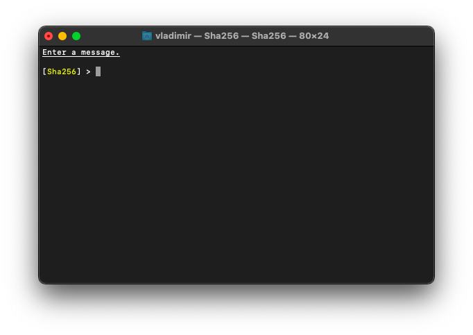
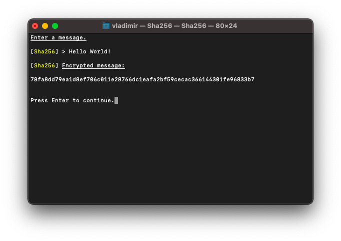

# ☝️Sha256 



## What is it?

This is an implementation and console application of _Sha256_ hash function, one of the most famous hash function. It is a part of [_RedLibrary_](https://github.com/Red-company/RedLibrary).

## How to use?

Function prototype:

```C
// Get sha256 hash.
std::string * Sha256Hash(std::string * input);
```

## What about speed?

Speed test can be found [_here._](https://github.com/Red-Laboratory/exp1_sha256-speedtest)

## Tech notes:

* It understands all _ASCII_ characters.
* It's rather fast.

## Example:


##
All material in this repository is in the public domain.
